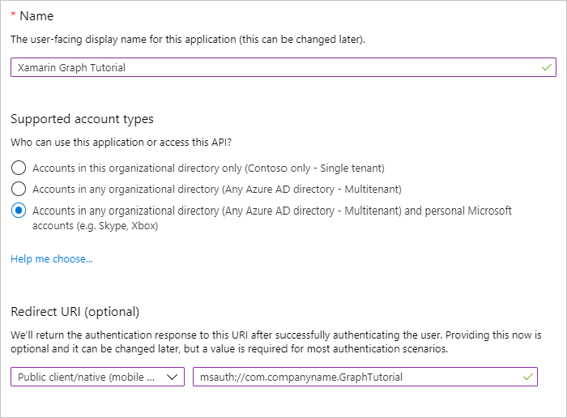
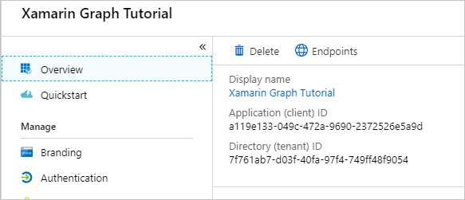
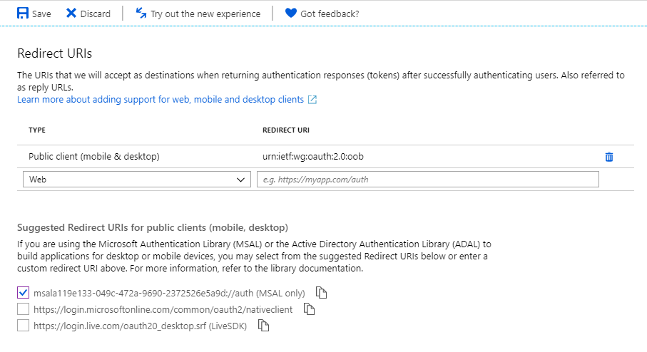

# Cómo ejecutar el proyecto completado

## Requisitos previos

Para ejecutar el proyecto completado en esta carpeta, necesita lo siguiente:

- [Visual Studio](https://visualstudio.microsoft.com/vs/) instalado en el equipo de desarrollo. (**Nota:** este tutorial se ha escrito con visual Studio 2017 versión 15.9.6 y Visual Studio para Mac versión 7.7.4. Los pasos de esta guía pueden funcionar con otras versiones, pero no se han probado.
- Xamarin instalado como parte de la instalación de Visual Studio. Consulte [instalar Xamarin](https://docs.microsoft.com/xamarin/cross-platform/get-started/installation) para obtener instrucciones sobre cómo instalar y configurar Xamarin.
- Una cuenta de Microsoft personal con un buzón de correo en Outlook.com o una cuenta profesional o educativa de Microsoft.

Si no tiene una cuenta de Microsoft, hay un par de opciones para obtener una cuenta gratuita:

- Puede [registrarse para obtener una nueva cuenta Microsoft personal](https://signup.live.com/signup?wa=wsignin1.0&rpsnv=12&ct=1454618383&rver=6.4.6456.0&wp=MBI_SSL_SHARED&wreply=https://mail.live.com/default.aspx&id=64855&cbcxt=mai&bk=1454618383&uiflavor=web&uaid=b213a65b4fdc484382b6622b3ecaa547&mkt=E-US&lc=1033&lic=1).
- Puede [registrarse para el programa de desarrolladores de office 365](https://developer.microsoft.com/office/dev-program) para obtener una suscripción gratuita a Office 365.

## Registrar una aplicación con Azure portal

1. Abra un explorador y vaya al [centro de administración de Azure Active Directory](https://aad.portal.azure.com). Inicie sesión con una **cuenta personal** (también conocida como: cuenta Microsoft) o una **cuenta profesional o educativa**.

1. Seleccione **Nuevo registro**. En la página **Registrar una aplicación**, establezca los valores siguientes.

    - Establezca **Nombre** como `Xamarin Graph Tutorial`.
    - Establezca **Tipos de cuenta admitidos** en **Cuentas en cualquier directorio de organización y cuentas personales de Microsoft**.
    - Deje **URI de redireccionamiento** vacía.

    

1. Elija **Registrar**. En la página **tutorial de Xamarin Graph** , copie el valor del **identificador de la aplicación (cliente)** y guárdelo, lo necesitará en el paso siguiente.

    

1. Seleccione el vínculo **Agregar un URI de redireccionamiento** . En la página **URI de redireccionamiento** , busque la sección **URI de redireccionamiento sugeridos para clientes públicos (móvil, escritorio)** . Seleccione el URI que comienza con `msal` **y** el **urn: IETF: WG: OAuth: 2.0:** el URI de OOB. Copie el valor que comienza con `msal`y, a continuación, elija **Guardar**. Guarde el URI de redireccionamiento copiado y lo necesitará en el paso siguiente.

    

## Configuración del ejemplo

1. Cambie el nombre `./GraphTutorial/GraphTutorial/Models/OAuthSettings.cs.example` del archivo `OAuthSettings.cs`a.
1. Edite `OAuthSettings.cs` el archivo y realice los cambios siguientes.
    1. Reemplace `YOUR_APP_ID_HERE` por el **identificador de aplicación** que obtuvo desde el portal de Azure.
1. En el proyecto **GraphTutorial. iOS** , abra el `Info.plist` archivo.
    1. En la ficha **avanzadas** , busque la sección **tipos de URL** . En el valor **esquemas** de URL `YOUR_APP_ID_HERE` , reemplace por el **identificador de aplicación** que obtuvo desde el portal de Azure.
1. En el proyecto **GraphTutorial. Android** , abra el `Properties/AndroidManifest.xml` archivo.
    1. Reemplace `YOUR_APP_ID_HERE` por el **identificador de aplicación** que obtuvo desde el portal de Azure.

## Ejecutar el ejemplo

En Visual Studio, presione **F5** o elija **depurar > iniciar depuración**.
